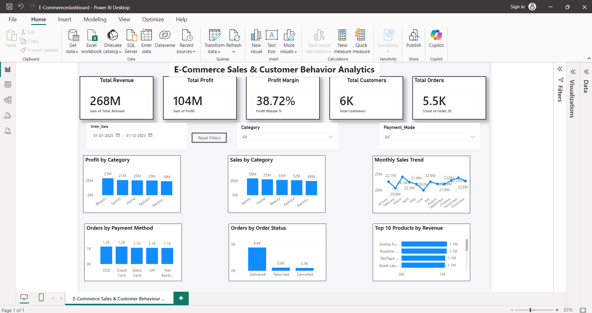

# E-Commerce Sales & Customer Behaviour Analytics

## 📊 Project Overview

This project analyzes e-commerce sales and customer behaviour data to identify important business trends, revenue patterns, profitability, customer activity, and product performance.

An interactive Power BI dashboard was created to present the analysis in a clear and business-friendly format.

## 📊 Power BI Dashboard




## 🎯 Objectives

- Analyze overall sales and revenue performance
- Measure total profit and profit margin
- Analyze sales and profit by category
- Understand order distribution by payment method
- Analyze order status
- Identify monthly sales trends
- Identify top-performing products by revenue
- Provide interactive filters for business analysis

## 🛠️ Tools & Technologies

- Python
- Pandas
- Power BI
- SQL
- Data Visualization

## 📈 Key Dashboard KPIs

- Total Revenue: ₹267.88M
- Total Profit: ₹103.72M
- Profit Margin: 38.72%
- Total Customers: 6K
- Total Orders: 5.5K

## 📊 Dashboard Features

The Power BI dashboard includes:

- KPI Cards
- Profit by Category
- Sales by Category
- Monthly Sales Trend
- Orders by Payment Method
- Orders by Order Status
- Top 10 Products by Revenue
- Order Date Filter
- Category Filter
- Payment Mode Filter
- Reset Filters

## 💡 Key Insights

- Beauty generated the highest profit among the categories.
- Sports generated the highest sales revenue among the categories.
- Delivered orders represent the largest share of orders.
- The dashboard provides monthly sales trends to understand changes in revenue throughout the year.
- Payment methods can be compared using the interactive payment mode analysis.

## 📁 Project Structure

```text
ecommerce-sales-customer-behavior-analysis/
│
├── README.md
├── data/
├── python/
├── powerbi/
└── screenshots/
## 👨‍💻 Author

Prathmesh Patil

Data Analyst | Power BI | Python | SQL | Data Visualization
